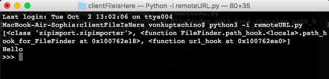

# URL Hook starter pack:
```python
import re
import sys
from urllib.request import urlopen
from importlib.abc import PathEntryFinder
from importlib.util import spec_from_loader
from urllib.request import urlopen

def url_hook(some_str):
    """ С помощью этой функции мы перехватываем ситуацию, в которой то,
    что мы собираемся импортировать является URL-адресом"""
    if not some_str.startswith(("http", "https")):                  #some fixed bugs here
        raise ImportError
    with urlopen(some_str) as page:
        data = page.read().decode("utf-8")
    filenames = re.findall("[a-zA-Z_][a-zA-Z0-0_]*.py", data)
    modnames = {name[:-3] for name in filenames}
    return URLFinder(some_str, modnames)                            #and here

sys.path_hooks.append(url_hook)
print(sys.path_hooks)

class URLLoader:
    def create_module(self, target):
        return None
    
    def exec_module(self, module):
        with urlopen(module.__spec__.origin) as page:
            source = page.read()
        code = compile(source, module.__spec__.origin, mode="exec")
        exec(code, module.__dict__)

class URLFinder(PathEntryFinder):
    def __init__(self, url, available):
        self.url = url
        self.available = available
        
    def find_spec(self, name, target=None):
        if name in self.available:
            origin = "{}/{}.py".format(self.url, name)
            loader = URLLoader()
            return spec_from_loader(name, loader, origin=origin)
        
        else:
            return None
```
Then add:
```python
sys.path.append("http://localhost:8000")

import remotePack #goes from remotePackIsHere/remotePack.py
fun() 
```
## Set up our server:
```console
cd cleinFileIsHere
python3 -m http.server
python3 -i remoteURL.py
```

Cool!
